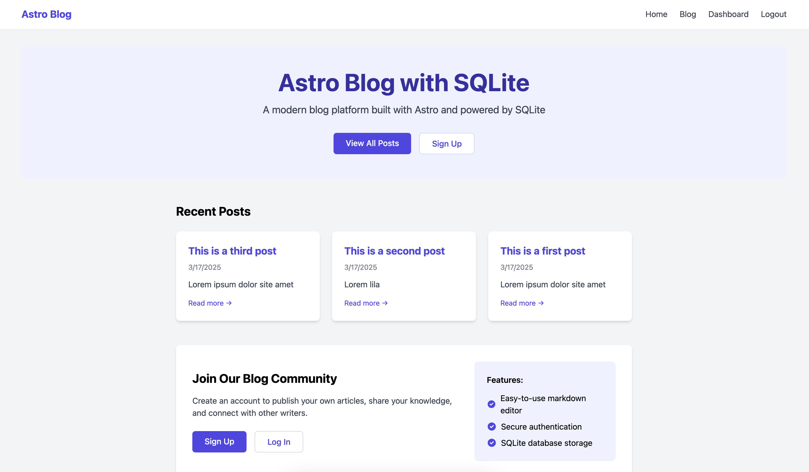

# Astro Blog System with SQLite/Turso

An Astro blog CMS system powered by SQLite (locally/VPS) or Turso (for serverless deployments).

## Features

-   🚀 Ultra-fast performance with local SQLite
-   🔐 Secure cookie-based sessions
-   🔄 Seamless transition to serverless with Turso
-   👤 User authentication with JWT
-   ✏️ Markdown post editor with preview
-   📱 Responsive design with Tailwind CSS

## Preview



## Getting Started

### Prerequisites

-   Node.js 16 or newer
-   npm or yarn

### Installation

1. Clone this repository:

    ```bash
    git clone https://github.com/yourusername/astro-libsql-blog.git
    cd astro-libsql-blog
    ```

2. Install dependencies:

    ```bash
    npm install
    ```

3. Initialize the database:

    ```bash
    npm run init-db
    ```

4. Start the development server:
    ```bash
    npm run dev
    ```

Your blog should now be running at `http://localhost:4321`

## Database Setup

### Local SQLite (Default)

By default, the application uses a local SQLite database file. This configuration offers the best performance for self-hosted environments.

The database connection is configured in `src/lib/db.js`:

```javascript
// src/lib/db.js
import { createClient } from '@libsql/client';

export const db = createClient({
    url: 'file:local.db',
});
```

### Using Turso for Serverless

To use Turso as your database for serverless deployments:

1. Sign up for a Turso account at [turso.tech](https://turso.tech)
2. Create a new database in the Turso dashboard
3. Get your database URL and authentication token
4. Update your database configuration:

```javascript
// src/lib/db.js
import { createClient } from '@libsql/client';

export const db = createClient({
    url: process.env.DATABASE_URL || 'file:local.db',
    authToken: process.env.DATABASE_AUTH_TOKEN,
});
```

5. Set the environment variables `DATABASE_URL` and `DATABASE_AUTH_TOKEN` in your deployment environment

## Database Initialization

The application requires tables for users, posts, and sessions. To initialize these tables:

1. Make sure the initialization script is properly configured in your package.json:

    ```json
    "scripts": {
      "init-db": "node --experimental-specifier-resolution=node --loader ts-node/esm src/scripts/init-db.js"
    }
    ```

2. Run the initialization script:
    ```bash
    npm run init-db
    ```

If using Turso, the same initialization script will work with the remote database when you've configured the connection properly with environment variables.

## Deployment

### Building for Production

```bash
npm run build
```

This will create a `dist` directory containing your production-ready application.

### Deploying on a VPS/Plesk

When deploying to a VPS with Plesk:

1. Set the **application root** to the project root directory (where package.json is located)
2. Set the document root appropriately (typically to `dist/client` for Astro SSR)
3. Make sure your Node.js version is compatible (v16+)
4. Install dependencies on the server with `npm install`
5. Start the application using the appropriate startup file

### Deploying on Serverless

For serverless deployment:

1. Configure your database to use Turso
2. Set the required environment variables
3. Follow the deployment instructions for your serverless platform (Vercel, Netlify, etc.)

## Security Considerations

For production:

1. Change the JWT secret in `src/lib/auth.js` to a secure random string
2. Ensure HTTPS is enabled for your domain
3. Set appropriate cookie security options for production
4. Back up your SQLite database file regularly (if using local SQLite)

## License

This project is licensed under the MIT License - see the LICENSE file for details.
